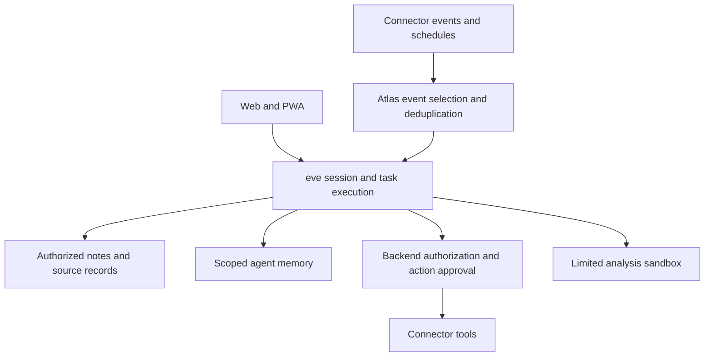

# Architecture discussion baseline

No application scaffold exists yet. The repository contains planning material and static prototypes. This page supersedes the earlier production specification; it does not claim that any provider or runtime integration has been verified.

## Direction and open choices

| Area | Status |
| --- | --- |
| Tooling | Vite+ selected; verify its check/test/build coverage during scaffold |
| Agent runtime | eve selected as the direction; deployment and integration must pass a working spike |
| Client | Web/PWA first; React direction, exact TanStack/framework arrangement for team review |
| Database and ORM | Open; PostgreSQL/Drizzle were proposals, not approved dependencies |
| Auth, file storage, connector provider | Open; compare actual required capabilities and cost |
| API | REST and GraphQL remain options; relationships alone do not require GraphQL |
| Memory provider | Open; file-based and hosted approaches can be tested without requiring a vector DB |
| Model and gateway | Open; validate OpenRouter credit use and tool quality with evals |
| Hosting | Vercel direction with existing Pro; exact services and team access unverified |

## Responsibility boundaries



Use eve capabilities before implementing a second agent loop, task journal, approval wait, stream resume mechanism, or eval runner. Confirm each capability against the pinned version. Atlas still owns user authorization, source provenance, product data, event selection, and external action outcomes.

A connector tool is not necessarily a sync service. Verify Gmail/Calendar scopes, event delivery, backfill, token refresh, account disconnection, and provider limits before selecting an adapter. Composio is a candidate where native connections leave a gap.

## Data that must stay distinct

- User-authored notes: editable content with clear ownership.
- Source records: provider identity, source link, timestamps, and the authorized content needed for the feature.
- AI-produced notes and claims: labeled as generated, with source references and corrections where applicable.
- Working state: the agent's current plan, task status, and session continuation data.
- Long-term memory: selected cross-session knowledge, subject to access, correction, and deletion.
- Actions: exact intended operation, approval, attempt identity, and observed provider outcome.

These are conceptual responsibilities, not six databases or a finalized schema. Agent memory does not replace the user's source archive.

## Small starting layout

Proposed only; create folders when they contain real code:

```text
apps/web/       PWA and product screens
apps/agent/     eve integration and Atlas backend modules
packages/       Only code genuinely shared by multiple apps
```

Do not pre-create worker, billing, vector, ingestion, or OKF packages. Do not add another workflow system or continuous heartbeat until a concrete gap requires it. Agent state must survive sandbox shutdown. Persist useful artifacts outside disposable compute.

## OKF reminder

The earlier plan treated Google's Open Knowledge Format as a portable, agent-readable export/import bundle, not the live database, retrieval engine, or agent runtime. That portability idea remains a candidate, not a required first-release subsystem.

Before implementation, map Atlas sources, authorship, relations, permissions, and attachment references to the format; define conflict handling and idempotent import. An export must exclude credentials and respect the exporting user's access. Do not promise a lossless round trip without testing it. See the [upstream project](https://github.com/GoogleCloudPlatform/open-knowledge-format).

## Validation before scaffold expansion

1. Client sends a message to eve and resumes after disconnect.
2. Authorized source retrieval cannot cross user boundaries.
3. A connector action waits for approval; rejection prevents execution.
4. A retry after interruption does not duplicate an external effect.
5. Sandbox analysis returns a persisted artifact within cost/time limits.
6. Deterministic tests and a small real-model eval measure the behavior separately.

Start with synthetic data and one useful flow. Add retrieval indexes, OCR, graph views, and extra services only when a measured use case justifies them.

## Primary references

- [eve documentation](https://eve.dev/docs) and [source](https://github.com/vercel/eve)
- [eve evals](https://eve.dev/docs/evals/overview)
- [Vite+](https://viteplus.dev/guide/)
- [Google OAuth lifecycle](https://developers.google.com/identity/protocols/oauth2)

These are implementation references, not evidence that Atlas already integrates them.
